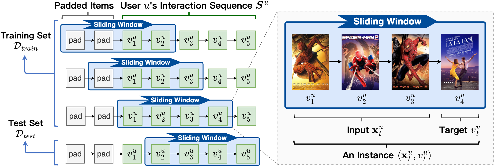
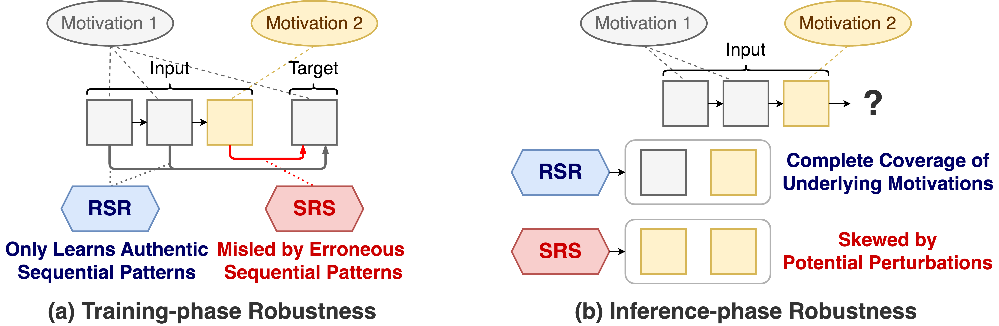
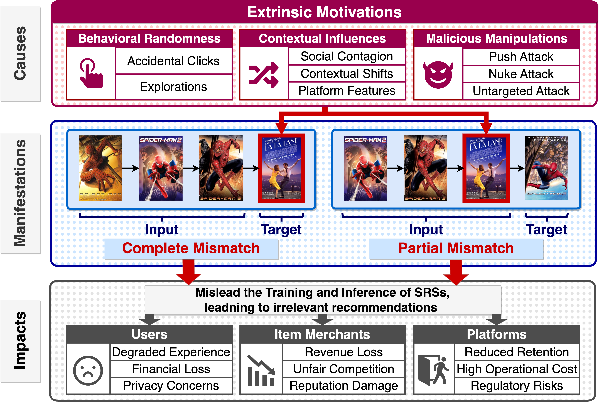
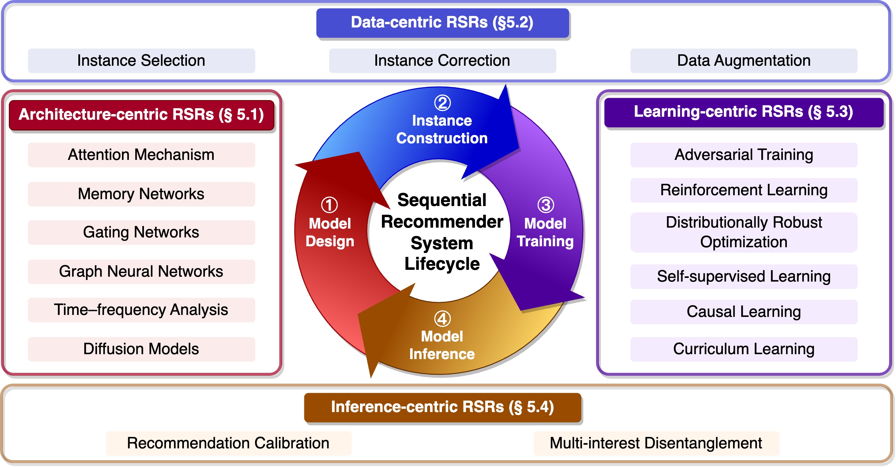
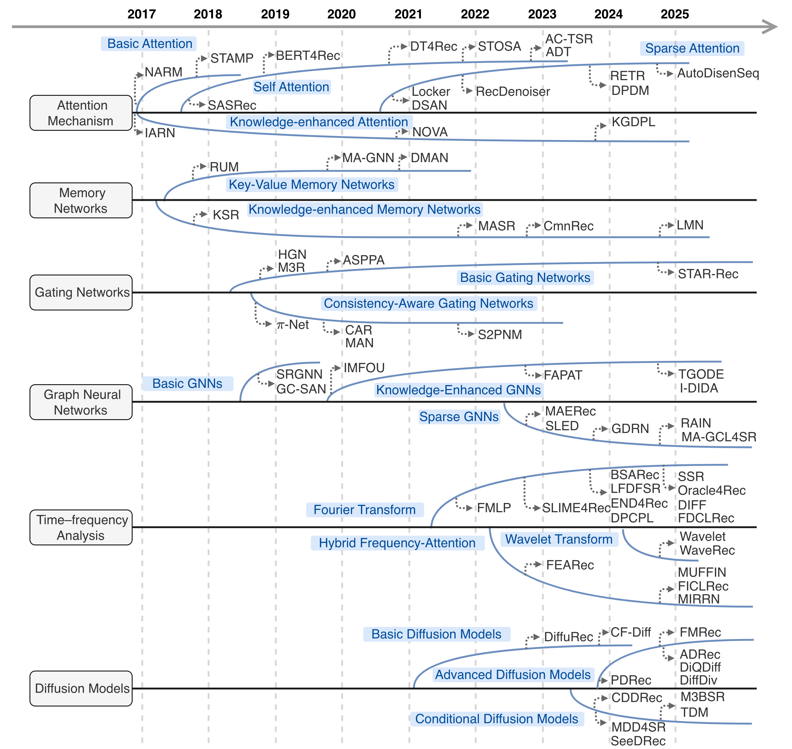
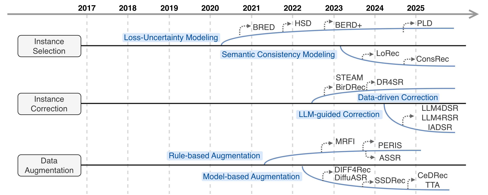
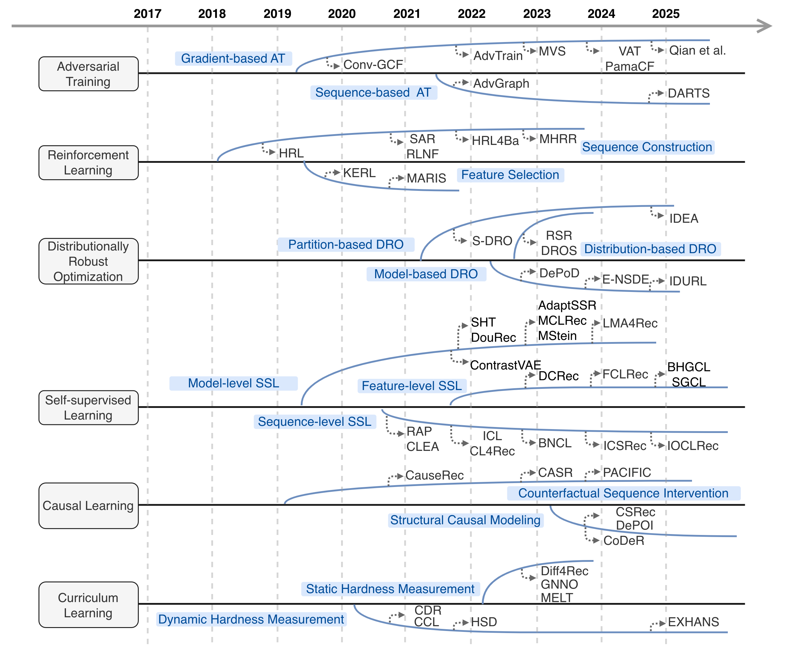
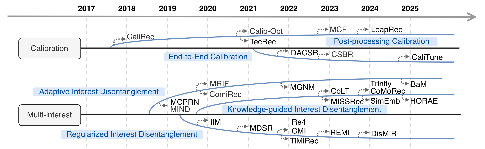

# A Survey on Robust Sequential Recommendation: Fundamentals, Challenges, Taxonomy, and Future Directions

Survey Link: [Link to the paper on Preprint](https://arxiv.org/abs/)

In the era of information overload, sequential recommender systems (SRSs) have become indispensable tools for modeling users' dynamic preferences, assisting personalized decision-making and information filtering, and thus attracting significant research and industrial attention. 
Conventional SRSs operate on a critical assumption that every input interaction sequence is reliably matched with the target subsequent interaction. However, this assumption is frequently violated in practice: real-world user behaviors are often driven by extrinsic motivations—such as behavioral randomness, contextual influences, and malicious attacks—which introduce perturbations into interaction sequences. These perturbations result in mismatched input-target pairs, termed as \textit{unreliable instances}, which corrupt sequential patterns, mislead model training and inference, and ultimately degrade recommendation accuracy. To mitigate these issues, the study of Robust Sequential Recommenders (RSRs) has thus emerged as a focal point.
This survey provides the first systematic review of advances in RSR research. We begin with a thorough analysis of unreliable instances, detailing their causes, manifestations, and adverse impacts. We then delineate the unique challenges of RSRs, which are absent in non-sequential settings and general denoising tasks. Subsequently, we present a holistic taxonomy of RSR methodologies and a systematic comparative analysis based on eight key properties, critically evaluating the strengths and limitations of existing approaches. We also summarize standard evaluation metrics and benchmarks. Finally, we identify open issues and discuss promising future research directions.

# Table of Contents
- [Background and Fundamentals](#Background-and-Fundamentals)
- [Unreliable Instances in Sequential Recommendation](#Unreliable-Instances-in-Sequential-Recommendation)
- [Taxonomy of RSRs](#Taxonomy-of-RSRs)
- [Evaluation Framework of RSRs](#Evaluation-Framework-of-RSRs)
  - [Architecture-centric RSRs](#Architecture-centric-RSRs)
  - [Data-centric RSRs](#Data-centric-RSRs)
  - [Learning-centric RSRs](#Learning-centric-RSRs)
  - [Inference-centric RSRs](#Inference-centric-RSRs )

# Background and Fundamentals

An example showing how an interaction sequence is split into data instances by a sliding window.
In each step of sliding, the last item in the sliding window is treated as the target of an instance, while the
preceding items in the window serve as the input.

- **Training-phase Robustness**: During training, the RSR must precisely identify items within
the input sequence that are genuinely relevant to the target (i.e., driven by the same intrinsic
motivations). By focusing on these items, the model avoids learning erroneous patterns from
perturbations.
- **Inference-phase Robustness**: During inference, the target is unobservable. The RSR must
infer the underlying motivations from the input and ensure the recommendation list provides
complete coverage for these motivations, without being skewed by perturbations [26, 27].

# Unreliable Instances in Sequential Recommendation

# Taxonomy of RSRs

- **Architecture-centric RSRs** embed robustness directly into the model architecture through perturbation-resistant designs (e.g., gating mechanisms or diffusion models), ensuring stable internal representations despite perturbed sequences.
- **Data-centric RSRs** operate at the Instance Construction stage, focusing on cleansing training data before or during model training. They proactively identify and rectify mismatched input-target pairs (via selection, reweighting, or correction), thereby eliminating erroneous sequential patterns from the training process.
- **Learning-centric RSRs** introduce robustness during model training. Rather than modifying the data or core architecture, they leverage specialized training strategies (e.g., adversarial training, robust loss functions) to guide the model to learn genuine user preferences while diminishing the influence of unreliable instances.
- **Inference-centric RSRs** address robustness at the final model inference stage. Acknowledging that real-time input sequences may contain perturbations, these methods generate comprehensive and balanced recommendation lists that fully capture users’ underlying motivations and avoid being skewed by perturbations.

# Evaluation Framework of RSRs

- **Multi-cause Robustness**: Ability to address diverse extrinsic motivations (behavioral randomness, contextual influences, malicious manipulations) that induce unreliable instances.
- **Dual-manifestation Robustness**: Capacity to handle both complete mismatch (perturbed targets) and partial mismatch (perturbed inputs).
- **Dual-phase Robustness**: Capability to satisfy robustness requirements (Section~\ref{sec:rsr-definition}) in both the training phase and the inference phase.
- **Motivation Transformation Awareness**: Ability to model transformations between intrinsic and extrinsic motivations over time.
- **Generality**: Compatibility with existing SRSs without extensive architectural modifications.
- **Data Accessibility**: Independence on side information (e.g., item attributes, user demographics) beyond raw user-item interaction data.
- **Scalability**: Efficiency in large-scale real-world scenarios.
- **Theoretical Grounding**: Existence of formal theoretical guarantees (e.g., robustness bounds, convergence proofs) for the method’s efficacy.

## Architecture-centric RSRs

| Category | Subcategory | Method | Venue-Year | P1: Multi-cause Robustness | P2: Dual-manifestation Robustness | P3: Dual-phase Robustness | P4: Motivation Transformation Awareness | P5: Generality | P6: Data Accessibility | P7: Scalability | P8: Theoretical Grounding |
|----------|-------------|--------------------------------------------------------|------------|----------------------|-----------------------------|----------------------|-----------------------------------|-----------|-------------------|-------------|---------------------|
| **Attention Mechanism** | **Basic Attention** | Neural Attentive Session-based Recommendation ([NARM](https://dl.acm.org/doi/10.1145/3132847.3132926)) | CIKM'17 | △ | △ | △ | × | × | ○ | △ | × |
| | | STAMP: short-term attention/memory priority model for session-based recommendation([STAMP](https://dl.acm.org/doi/10.1145/3219819.3219950)) | KDD'18 | △ | △ | △ | × | × | ○ | ○ | × |
| | **Self Attention** | Self-attentive sequential recommendation([SASRec](https://arxiv.org/abs/1808.09781)) | ICDM'18 | △ | △ | △ | × | × | ○ | △ | × |
| | | BERT4Rec: Sequential Recommendation with Bidirectional Encoder Representations from Transformer([BERT4Rec](https://dl.acm.org/doi/10.1145/3357384.3357895)) | CIKM'19 | △ | △ | △ | × | × | ○ | △ | × |
| | | Modeling Sequences as Distributions with Uncertainty for Sequential Recommendation([DT4Rec](https://dl.acm.org/doi/abs/10.1145/3459637.3482145)) | CIKM'21 | △ | △ | △ | × | × | ○ | △ | × |
| | | Sequential Recommendation via Stochastic Self-Attention([STOSA](https://dl.acm.org/doi/10.1145/3485447.3512077)) | WWW'22 | △ | △ | △ | × | × | ○ | △ | × |
| | | Adaptive Disentangled Transformer for Sequential Recommendation([ADT](https://dl.acm.org/doi/10.1145/3580305.3599253)) | KDD'23 | △ | △ | △ | × | × | ○ | △ | × |
| | | Attention Calibration for Transformer-based Sequential Recommendation([AC-TSR](https://dl.acm.org/doi/10.1145/3583780.3614785)) | CIKM'23 | △ | △ | △ | × | × | ○ | △ | × |
| | **Sparse Attention** | Dual Sparse Attention Network For Session-based Recommendation([DSAN](https://ojs.aaai.org/index.php/AAAI/article/view/16593) | AAAI'21 | △ | △ | △ | × | × | ○ | △ | × |
| | | Locker: Locally Constrained Self-Attentive Sequential Recommendation([Locker](https://dl.acm.org/doi/10.1145/3459637.3482136)) | CIKM'21 | △ | △ | △ | × | × | ○ | △ | × |
| | | Denoising Self-Attentive Sequential Recommendation([RecDenoiser](https://dl.acm.org/doi/abs/10.1145/3523227.3546788)) | RecSys'22 | △ | △ | △ | × | × | ○ | △ | × |
| | | Recommender Transformers with Behavior Pathways([RETR](https://dl.acm.org/doi/abs/10.1145/3589334.3645528)) | WWW'24 | △ | △ | △ | × | × | ○ | △ | × |
| | | Dual perspective denoising model for session-based recommendation([DPDM](https://www.sciencedirect.com/science/article/pii/S0957417424007115)) | ESWA'24 | △ | △ | △ | × | × | ○ | △ | × |
| | | Automated Disentangled Sequential Recommendation with Large Language Models([AutoDisenSeq](https://dl.acm.org/doi/full/10.1145/3675164)) | TOIS'25 | △ | △ | △ | × | × | ○ | △ | × |
| | **Knowledge-enhanced Attention** | Interacting Attention-gated Recurrent Networks for Recommendation([IARN](https://dl.acm.org/doi/abs/10.1145/3132847.3133005)) | CIKM'17 | △ | △ | △ | × | × | × | × | × |
| | | Noninvasive Self-attention for Side Information Fusion in Sequential Recommendation([NOVA](https://ojs.aaai.org/index.php/AAAI/article/view/16549) | AAAI'21 | △ | △ | △ | × | × | × | × | × |
| | | Knowledge Graph-Based Behavior Denoising and Preference Learning for Sequential Recommendation([KGDPL](https://ieeexplore.ieee.org/document/10287604)) | TKDE'24 | △ | △ | △ | × | × | × | × | × |
| **Memory Networks** | **Key-value MN** | Sequential Recommendation with User Memory Networks([RUM](https://dl.acm.org/doi/10.1145/3159652.3159668)) | WSDM'18 | △ | △ | △ | × | × | ○ | × | × |
| | | Memory Augmented Graph Neural Networks for Sequential Recommendation([MAGNN](https://arxiv.org/abs/1912.11730)) | AAAI'20 | △ | △ | △ | × | × | ○ | × | × |
| | | Dynamic Memory based Attention Network for Sequential Recommendation([DMAN](https://ojs.aaai.org/index.php/AAAI/article/view/16564)) | AAAI'21 | △ | △ | △ | × | × | ○ | × | × |
| | | Memory Bank Augmented Long-tail Sequential Recommendation([MASR](https://dl.acm.org/doi/10.1145/3511808.3557391)) | CIKM'22 | △ | △ | △ | × | × | ○ | △ | × |
| | **Knowledge-enhanced MN** | Improving sequential recommendation with knowledge-enhanced memory networks([KSR](https://dl.acm.org/doi/10.1145/3209978.3210017)) | SIGIR'18 | △ | △ | △ | × | × | × | × | × |
| | | CmnRec: Sequential Recommendations With Chunk-Accelerated Memory Network([CmnRec](https://ieeexplore.ieee.org/document/9674224)) | TKDE'23 | △ | △ | △ | × | × | × | △ | × |
| | | Large Memory Network for Recommendation([LMN](https://dl.acm.org/doi/10.1145/3701716.3715514)) | WWW'25 | △ | △ | △ | × | × | × | △ | × |
| **Gating Networks** | **Basic Gating Networks** | Hierarchical gating networks for sequential recommendation([HGN](https://arxiv.org/abs/1906.09217)) | KDD'19 | △ | △ | △ | × | × | ○ | △ | × |
| | | Towards neural mixture recommender for long range dependent user sequences([M3R](https://dl.acm.org/doi/10.1145/3308558.3313650)) | WWW'19 | △ | △ | △ | × | × | ○ | △ | × |
| | | Discovering Subsequence Patterns for Next {POI} Recommendation([ASPPA](https://www.ijcai.org/Proceedings/2020/445)) | IJCAI'20 | △ | △ | △ | × | × | ○ | △ | × |
| | | STAR-Rec: Making Peace with Length Variance and Pattern Diversity in Sequential Recommendation([STAR-Rec](https://arxiv.org/abs/2505.03484)) | SIGIR'25 | △ | △ | △ | × | × | ○ | △ | × |
| | **Consistency-aware Gating Networks** | $\pi$-Net: A Parallel Information-sharing Network for Shared-account Cross-domain Sequential Recommendations([π-Net](https://dl.acm.org/doi/10.1145/3331184.3331200)) | SIGIR'19 | △ | △ | △ | × | × | ○ | △ | × |
| | | Consistency-Aware Recommendation for User-Generated Item List Continuation([CAR](https://dl.acm.org/doi/abs/10.1145/3336191.3371776)) | WSDM'20 | △ | △ | △ | × | × | ○ | △ | × |
| | | Memory Augmented Neural Model for Incremental Session-based Recommendation([MAN](https://arxiv.org/abs/2005.01573)) | IJCAI'20 | △ | △ | △ | × | × | ○ | △ | × |
| | | Modeling Dynamic User Preference via Dictionary Learning for Sequential Recommendation([S2PNM](https://ieeexplore.ieee.org/document/9319527)) | TKDE'22 | △ | △ | △ | × | × | ○ | △ | × |
| **Graph Neural Networks** | **Basic GNNs** | Graph Contextualized Self-Attention Network for Session-based Recommendation([GCSAN](https://www.ijcai.org/Proceedings/2019/547)) | IJCAI'19 | △ | △ | △ | × | × | ○ | △ | × |
| | | Session-based recommendation with graph neural networks([SRGNN](https://dl.acm.org/doi/10.1609/aaai.v33i01.3301346)) | AAAI'19 | △ | △ | △ | × | × | ○ | △ | × |
| | **Knowledge-enhanced GNNs** | Intention Modeling from Ordered and Unordered Facets for Sequential Recommendation([IMFOU](https://dl.acm.org/doi/abs/10.1145/3366423.3380190)) | WWW'20 | △ | △ | △ | × | × | × | × | × |
| | | Enhancing User Intent Capture in Session-Based Recommendation with Attribute Patterns([FAPAT](https://neurips.cc/virtual/2023/poster/72538)) | NeurIPS'23 | △ | △ | △ | × | × | × | × | × |
| | | Disentangled Dynamic Graph Attention Network for Out-of-Distribution Sequential Recommendation([I-DIDA](https://dl.acm.org/doi/abs/10.1145/3701988)) | TOIS'25 | △ | △ | △ | △ | × | × | × | × |
| | | Time Matters: Enhancing Sequential Recommendations with Time-Guided Graph Neural ODEs([TGODE](https://dl.acm.org/doi/abs/10.1145/3711896.3737156)) | KDD'25 | △ | △ | △ | △ | × | × | × | × |
| | **Sparse GNNs** | {SLED:} Structure Learning based Denoising for Recommendation([SLED](https://dl.acm.org/doi/10.1145/3611385)) | TOIS'23 | △ | △ | △ | × | × | ○ | △ | × |
| | | Graph Masked Autoencoder for Sequential Recommendation([MAERec](https://dl.acm.org/doi/abs/10.1145/3539618.3591692)) | SIGIR'23 | △ | △ | △ | × | × | ○ | △ | × |
| | | Graph Diffusion-Based Representation Learning for Sequential Recommendation([GDRN](https://ieeexplore.ieee.org/document/10713269)) | TKDE'24 | △ | △ | △ | × | × | ○ | △ | × |
| | | {RAIN:} Reconstructed-aware in-context enhancement with graph denoising for session-based recommendation([RAIN](https://www.sciencedirect.com/science/article/abs/pii/S0893608024009857)) | NN'25 | △ | △ | △ | × | × | ○ | △ | × |
| | | {MA-GCL4SR:} Improving Graph Contrastive Learning-Based Sequential Recommendation with Model Augmentation([MA-GCL4SR](https://dl.acm.org/doi/10.1145/3722561)) | TKDD'25 | △ | △ | △ | × | × | ○ | △ | × |
| **Time-frequency Analysis** | **Fourier Transform** | Filter-enhanced MLP is All You Need for Sequential Recommendation([FMLP](https://dl.acm.org/doi/10.1145/3485447.3512111)) | WWW'22 | △ | △ | △ | × | × | ○ | ○ | × |
| | | Contrastive Enhanced Slide Filter Mixer for Sequential Recommendation([SLIME4Rec](https://ieeexplore.ieee.org/document/10184602)) | ICDE'23 | △ | △ | △ | × | × | ○ | △ | × |
| | | An Attentive Inductive Bias for Sequential Recommendation beyond the Self-Attention([BSARec](https://ojs.aaai.org/index.php/AAAI/article/view/28747)) | AAAI'24 | △ | △ | △ | × | × | ○ | △ | × |
| | | Frequency-Domain Disentanglement-Fusion and Dual Contrastive Learning for Sequential Recommendation([FDCLRec](https://dl.acm.org/doi/10.1145/3746252.3761220)) | CIKM'25 | △ | △ | △ | × | × | ○ | △ | × |
| | | Learnable Filter with Decoupling Fusion Method for Sequential Recommendation([LFDFSR](https://ieeexplore.ieee.org/document/10831113)) | SMC'24 | △ | △ | △ | × | × | × | △ | × |
| | | Efficient Noise-Decoupling for Multi-Behavior Sequential Recommendation([END4Rec](https://dl.acm.org/doi/10.1145/3589334.3645380)) | WWW'24 | △ | △ | △ | × | × | ○ | △ | × |
| | | Denoising Pre-Training and Customized Prompt Learning for Efficient Multi-Behavior Sequential Recommendation([DPCPL](https://arxiv.org/abs/2408.11372)) | CoRR'24 | △ | △ | △ | × | × | ○ | △ | × |
| | | Cost-Effective On-Device Sequential Recommendation with Spiking Neural Networks([SSR](https://www.ijcai.org/proceedings/2025/398)) | IJCAI'25 | △ | △ | △ | × | × | ○ | ○ | × |
| | | Oracle-guided Dynamic User Preference Modeling for Sequential Recommendation([Oracle4Rec](https://dl.acm.org/doi/10.1145/3701551.3703542)) | WSDM'25 | △ | △ | △ | × | × | ○ | △ | × |
| | | DIFF: Dual Side-Information Filtering and Fusion for Sequential Recommendation([DIFF](https://dl.acm.org/doi/10.1145/3726302.3729948)) | SIGIR'25 | △ | △ | △ | × | × | × | △ | × |
| | **Wavelet Transform** | Learning a Wavelet Neural Filter with Mamba for Sequential Recommendation([Wavelet](https://ieeexplore.ieee.org/document/11060863)) | CISM'25 | △ | △ | △ | × | × | ○ | ○ | × |
| | | WaveRec: Is Wavelet Transform a Better Alternative to Fourier Transform for Sequential Recommendation?([WaveRec](https://dl.acm.org/doi/10.1145/3731120.3744621)) | ICTIR'25 | △ | △ | △ | × | × | ○ | ○ | × |
| | **Hybrid Frequency Attention** | Frequency Enhanced Hybrid Attention Network for Sequential Recommendation([FEARec](https://dl.acm.org/doi/10.1145/3539618.3591689)) | SIGIR'23 | △ | △ | △ | × | × | ○ | △ | × |
| | | Mixture of User-Adaptive Frequency Filtering for Sequential Recommendation ([MUFFIN](https://dl.acm.org/doi/abs/10.1145/3746252.3761190 )) | CIKM'25 | △ | △ | △ | × | × | ○ | △ | × |
| | | Frequency enhanced intent contrastive learning for sequential recommendation ([FICLRec](https://www.sciencedirect.com/science/article/abs/pii/S0306457325001724)) | IPM'25 | △ | △ | △ | × | × | ○ | △ | × |
| | | Multi-granularity Interest Retrieval and Refinement Network for Long-Term User Behavior Modeling in CTR Prediction([MIRRN](https://dl.acm.org/doi/abs/10.1145/3690624.3709438)) | KDD'25 | △ | △ | △ | × | × | ○ | × | × |
| **Diffusion Models** | **Basic Diffusion** | A Diffusion Model for Sequential Recommendation([DiffuRec](https://dl.acm.org/doi/full/10.1145/3631116)) | TOIS'23 | △ | △ | △ | × | × | ○ | × | × |
| | | Collaborative Filtering Based on Diffusion Models:Unveiling the Potential of High-Order Connectivity ([CF-Diff](https://dl.acm.org/doi/abs/10.1145/3626772.3657742)) | SIGIR'24 | △ | △ | △ | × | × | ○ | × | × |
| | **Conditional Diffusion** |Conditional Denoising Diffusion for Sequential Recommendation ([CDDRec](https://link.springer.com/chapter/10.1007/978-981-97-2262-4_13)) | PAKDD'24 | △ | △ | △ | × | × | ○ | × | × |
| | | Sememe-based Diffusion for Sequential Recommendation([SeeDRec](https://www.ijcai.org/proceedings/2024/251)) | IJCAI'24 | △ | △ | △ | × | × | × | × | × |
| | | Multi-Modal Multi-Behavior Sequential Recommendation with Conditional Diffusion-Based Feature Denoising([M3BSR](https://dl.acm.org/doi/abs/10.1145/3726302.3730044)) | SIGIR'25 | △ | △ | △ | × | × | × | × | × |
| | | Addressing Missing Data Issue for Diffusion-based Recommendation([TDM](https://dl.acm.org/doi/abs/10.1145/3726302.3729890)) | SIGIR'25 | △ | △ | △ | × | × | ○ | × | × |
| | **Advanced Diffusion** | Plug-In Diffusion Model for Sequential Recommendation([PDRec](https://ojs.aaai.org/index.php/AAAI/article/view/28736)) | AAAI'24 | △ | △ | △ | × | × | ○ | × | × |
| | | Flow Matching based Sequential Recommender Model([FMRec](https://arxiv.org/abs/2505.16298)) | IJCAI'25 | △ | △ | △ | × | × | ○ | × | × |
| | | Unlocking the Power of Diffusion Models in Sequential Recommendation: A Simple and Effective Approach([ADRec](https://dl.acm.org/doi/abs/10.1145/3711896.3737172)) | KDD'25 | △ | △ | △ | × | × | ○ | × | × |
| | | Unleashing the Potential of Diffusion Models Towards Diversified Sequential Recommendations([DiffDiv](https://dl.acm.org/doi/abs/10.1145/3726302.3730109)) | SIGIR'25 | △ | △ | △ | × | × | ○ | × | × |
| | | Distinguished Quantized Guidance for Diffusion-based Sequence Recommendation([DiQDiff](https://dl.acm.org/doi/abs/10.1145/3696410.3714955)) | WWW'25 | △ | △ | △ | × | × | ○ | × | × |

## Data-centric RSRs

| Category | Subcategory | Method | Venue-Year | Multi-cause Robustness | Dual-manifestation Robustness | Dual-phase Robustness | Motivation Transformation Awareness | Generality | Data Accessibility | Scalability | Theoretical Grounding |
|----------|-------------|--------|------------|----------------------|-----------------------------|----------------------|-----------------------------------|-----------|-------------------|-------------|---------------------|
| **Instance Selection** | **Loss-uncertainty Modeling** | Does Every Data Instance Matter? Enhancing Sequential Recommendation by Eliminating Unreliable Data([BERD](https://www.ijcai.org/proceedings/2021/0218.pdf)) | IJCAI'21 | △ | △ | △ | × | ○ | ○ | △ | × |
| | | A Generic Sequential Recommendation Framework by Eliminating Unreliable Data with Item- and Attribute-level Signals([BERD+](https://dl.acm.org/doi/full/10.1145/3611008)) | TOIS'23 | △ | △ | △ | × | ○ | × | △ | × |
| | | Personalized Denoising Implicit Feedback for Robust Recommender System([PLD](https://dl.acm.org/doi/abs/10.1145/3696410.3714932)) | WWW'25 | △ | △ | △ | × | ○ | ○ | ○ | × |
| | **Semantic Modeling** | Combating Poisons with Large Language Model for Robust Sequential Recommendation([LoRec](https://dl.acm.org/doi/abs/10.1145/3626772.3657684)) | SIGIR'24 | △ | △ | △ | × | ○ | × | × | × |
| | | Denoising Sequential Recommendation through User-Consistent Preference Modeling([ConsRec](https://arxiv.org/abs/2505.22130)) | CoRR'25 | △ | △ | △ | × | × | × | × | × |
| **Instance Correction** | **Data-driven Correction** | A Self-Correcting Sequential Recommender([STEAM](https://dl.acm.org/doi/abs/10.1145/3543507.3583479)) | WWW'23 | △ | ○ | △ | × | ○ | ○ | × | × |
| | | Theoretically Guaranteed Bidirectional Data Rectification for Robust Sequential Recommendation([BirDRec](https://proceedings.neurips.cc/paper_files/paper/2023/hash/08309150af77fc7c79ade0bf8bb6a562-Abstract-Conference.html)) | NeurIPS'23 | △ | ○ | △ | × | ○ | ○ | △ | ○ |
| | | Dataset Regeneration for Sequential Recommendation([DR4SR](https://dl.acm.org/doi/abs/10.1145/3637528.3671841)) | KDD'24 | △ | ○ | △ | × | ○ | ○ | △ | × |
| | **LLM-guided Correction** | Leveraing Large Language Model for Denoising Sequential Recommendation([LLM4DSR](https://dl.acm.org/doi/full/10.1145/3762182)) | TOIS'25 | △ | △ | △ | × | ○ | × | × | × |
| | | Large Language Models as Data Correctors for Robust Sequential Recommendation([LLM4RSR](https://ojs.aaai.org/index.php/AAAI/article/view/33374)) | AAAI'25 | △ | ○ | △ | × | ○ | × | △ | × |
| | | Empowering Denoising Sequential Recommendation with Large Language Model Embeddings([IADSR](https://dl.acm.org/doi/abs/10.1145/3746252.3761427)) | CIKM'25 | △ | △ | △ | × | ○ | △ | × | × |
| **Data Augmentation** | **Rule-based Augmentation** | Beyond Learning from Next Item: Sequential Recommendation via Personalized Interest Sustainability([PERIS](https://dl.acm.org/doi/abs/10.1145/3511808.3557415)) | CIKM'22 | △ | △ | △ | × | ○ | △ | ○ | × |
| | | Integrating Item Relevance in Training Loss for Sequential Recommender Systems([MRFI](https://dl.acm.org/doi/abs/10.1145/3604915.3610643)) | RecSys'23 | △ | △ | △ | × | ○ | ○ | ○ | × |
| | | Augmenting Short Sequence for Robust Session-based Recommendation([ASSR](https://ieeexplore.ieee.org/abstract/document/10963247)) | CAIT'24 | △ | △ | △ | × | ○ | ○ | △ | × |
| | **Model-base Augmentation** | Sequential Recommendation with Curriculum-scheduled Diffusion Augmentation([Diff4Rec](https://dl.acm.org/doi/abs/10.1145/3581783.3612709)) | MM'23 | △ | △ | △ | × | ○ | ○ | × | × |
| | | Diffusion Augmentation for Sequential Recommendation([DiffuASR](https://dl.acm.org/doi/abs/10.1145/3583780.3615134)) | CIKM'23 | △ | △ | △ | × | ○ | ○ | × | × |
| | | Self-Augmented Sequence Denoising for Sequential Recommendation([SSDRec](https://ieeexplore.ieee.org/abstract/document/10597765)) | ICDE'24 | △ | △ | △ | × | ○ | ○ | × | × |
| | | Adaptive in-context expert network with hierarchical data augmentation for sequential recommendation([CeDRec](https://www.sciencedirect.com/science/article/pii/S0950705125011062)) | KBS'25 | △ | △ | △ | × | × | ○ | × | × |
| | | Data Augmentation as Free Lunch: Exploring the Test-Time Augmentation for Sequential Recommendation([TTA](https://dl.acm.org/doi/abs/10.1145/3726302.3729943)) | SIGIR'25 | △ | △ | △ | × | ○ | ○ | ○ | × |

# Learning-centric RSRs

| Category | Subcategory | Method | Venue-Year | Multi-cause Robustness | Dual-manifestation Robustness | Dual-phase Robustness | Motivation Transformation Awareness | Generality | Data Accessibility | Scalability | Theoretical Grounding |
|----------|-------------|--------|------------|----------------------|-----------------------------|----------------------|-----------------------------------|-----------|-------------------|-------------|---------------------|
| **Adversarial Training** | **Gradient-based AT** | Defending Substitution-Based Profile Pollution Attacks on Sequential Recommenders([AdvTrain](https://dl.acm.org/doi/abs/10.1145/3523227.3546770)) | RecSys'22 | △ | △ | △ | × | ○ | ○ | × | × |
| | | Understanding and Improving Adversarial Collaborative Filtering for Robust Recommendation([PamaCF](https://proceedings.neurips.cc/paper_files/paper/2024/hash/da07cfa60cc883c5ee94ba899383bb6d-Abstract-Conference.html)) | NeurIPS'24 | △ | △ | △ | × | ○ | ○ | × | ○ |
| | | Improving the Shortest Plank: Vulnerability-Aware Adversarial Training for Robust Recommender System([VAT](https://dl.acm.org/doi/abs/10.1145/3640457.3688120)) | RecSys'24 | △ | △ | △ | × | ○ | ○ | × | × |
| | | Enhancing Multi-View Smoothness for Sequential Recommendation Models([MVS](https://dl.acm.org/doi/full/10.1145/3582495)) | TOIS'23 | △ | △ | △ | × | ○ | ○ | × | × |
| | | Understanding the Robustness of Deep Recommendation under Adversarial Attacks([Qian et al.](https://dl.acm.org/doi/full/10.1145/3744570)) | TKDD'25 | △ | △ | △ | × | ○ | ○ | × | × |
| | **Sequence-based AT** | Adversarial Graph Perturbations for Recommendations at Scale([AdvGraph](https://dl.acm.org/doi/abs/10.1145/3477495.3531763)) | SIGIR'22 | △ | △ | △ | × | ○ | ○ | × | × |
| | | A Dual-View Attack Framework for Targeted Manipulation in Federated Sequential Recommendation([DARTS](https://arxiv.org/abs/2507.01383)) | CoRR'25 | △ | △ | △ | × | ○ | ○ | × | × |
| **Reinforcement Learning** | **Sequence Construction** | Hierarchical Reinforcement Learning for Course Recommendation in MOOCs([HRL](https://ojs.aaai.org/index.php/AAAI/article/view/3815)) | AAAI'19 | △ | △ | △ | × | × | ○ | × | × |
| | | Sequence Adaptation via Reinforcement Learning in Recommender Systems([SAR](https://dl.acm.org/doi/abs/10.1145/3460231.3478864)) | RecSys'21 | △ | △ | △ | × | × | ○ | × | × |
| | | Reinforcement Learning based Noise Filtering for Click-Through Rate Prediction([RLNF](https://dl.acm.org/doi/abs/10.1145/3404835.3463012)) | SIGIR'21 | △ | △ | △ | × | × | ○ | × | × |
| | | DENOISING-ORIENTED DEEP HIERARCHICAL REINFORCEMENT LEARNING FOR NEXT-BASKET RECOMMENDATION?([HRL4Ba](https://ieeexplore.ieee.org/abstract/document/9747757)) | ICASSP'22 | △ | △ | △ | × | × | ○ | × | × |
| | | MOOCs Recommender Service With Meta Hierarchical Reinforced Ranking([MHRR](https://ieeexplore.ieee.org/abstract/document/10286866)) | TSC'23 | △ | △ | △ | × | × | × | × | × |
| | **Feature Selection** | A Knowledge-Guided Reinforcement Learning Model for Sequential Recommendation([KERL](https://dl.acm.org/doi/abs/10.1145/3397271.3401134)) | SIGIR'20 | △ | △ | △ | × | × | × | × | × |
| | | Multi-Agent RL-based Information Selection Framework for Sequential Recommendation([MARIS](https://dl.acm.org/doi/10.1145/3477495.3532022)) | SIGIR'22 | △ | △ | △ | × | × | × | × | × |
| **Distributionally Robust Optimization** | **Partition-based DRO** | Distributionally-robust Recommendations for Improving Worst-case User Experience([S-DRO](https://dl.acm.org/doi/abs/10.1145/3485447.3512255)) | WWW'22 | △ | △ | △ | ○ | ○ | ○ | ○ | △ |
| | | Mitigating Distribution Shifts in Sequential Recommendation: An Invariance Perspective([IDEA](https://dl.acm.org/doi/abs/10.1145/3726302.3730036)) | SIGIR'25 | △ | △ | △ | ○ | ○ | ○ | ○ | △ |
| | **Distribution-based DRO** | A Generic Learning Framework for Sequential Recommendation with Distribution Shifts([DROS](https://dl.acm.org/doi/abs/10.1145/3539618.3591624)) | SIGIR'23 | △ | △ | △ | ○ | ○ | ○ | ○ | △ |
| | | Distributionally Robust Sequential Recommendation([RSR](https://dl.acm.org/doi/10.1145/3539618.3591668)) | SIGIR'23 | △ | △ | △ | ○ | ○ | ○ | ○ | △ |
| | **Model-based DRO** | Decoupled Progressive Distillation for Sequential Prediction with Interaction Dynamics([DePoD](https://dl.acm.org/doi/full/10.1145/3632403)) | TOIS'24 | △ | △ | △ | ○ | ○ | ○ | × | △ |
| | | Evidential Stochastic Differential Equations for Time-Aware Sequential Recommendation([E-NSDE](https://proceedings.neurips.cc/paper_files/paper/2024/hash/7cdbd53dfbcf9a5263227555aac5b9cd-Abstract-Conference.html)) | NeurIPS'24 | △ | △ | △ | ○ | ○ | ○ | × | △ |
| | | Towards Interest Drift-driven User Representation Learning in Sequential Recommendation([IDURL](https://dl.acm.org/doi/abs/10.1145/3726302.3730099)) | SIGIR'25 | △ | △ | △ | ○ | ○ | × | × | △ |
| **Self-supervised Learning** | **Feature-level SSL** | Debiased Contrastive Learning for Sequential Recommendation([DCRec](https://dl.acm.org/doi/abs/10.1145/3543507.3583361)) | WWW'23 | △ | △ | △ | × | × | ○ | △ | × |
| | | Feature-Aware Contrastive Learning With Bidirectional Transformers for Sequential Recommendation([FCLRec](https://ieeexplore.ieee.org/abstract/document/10375742/)) | TKDE'24 | △ | △ | △ | × | × | × | △ | × |
| | | Symmetric Graph Contrastive Learning against Noisy Views for Recommendation([SGCL](https://dl.acm.org/doi/10.1145/3722103)) | TOIS'25 | △ | △ | △ | × | × | ○ | △ | × |
| | | Bottlenecked Heterogeneous Graph Contrastive Learning for Robust Recommendation([BHGCL](https://dl.acm.org/doi/10.1145/3750725)) | TOIS'25 | △ | △ | △ | × | × | × | △ | × |
| | **Sequence-level SSL** | Pattern-enhanced Contrastive Policy Learning Network for Sequential Recommendation([RAP](https://www.ijcai.org/proceedings/2021/220)) | IJCAI'21 | △ | △ | △ | × | × | ○ | △ | × |
| | | The World is Binary: Contrastive Learning for Denoising Next Basket Recommendation([CLEA](https://dl.acm.org/doi/10.1145/3404835.3462836)) | SIGIR'21 | △ | △ | △ | × | × | ○ | △ | × |
| | | Intent Contrastive Learning for Sequential Recommendation([ICL](https://dl.acm.org/doi/10.1145/3485447.3512090)) | WWW'22 | △ | △ | △ | × | × | ○ | × | × |
| | | Robust Basket Recommendation via Noise-tolerated Graph Contrastive Learning([BNCL](https://dl.acm.org/doi/10.1145/3583780.3615039)) | CIKM'23 | △ | △ | △ | × | × | ○ | △ | × |
| | | Contrastive Learning for Sequential Recommendation([CL4Rec](https://ieeexplore.ieee.org/abstract/document/9835621)) | ICDE'22 | △ | △ | △ | × | × | ○ | ○ | × |
| | | Intent Contrastive Learning with Cross Subsequences for Sequential Recommendation([ICSRec](https://dl.acm.org/doi/abs/10.1145/3616855.3635773)) | WSDM'24 | △ | △ | △ | × | × | ○ | ○ | × |
| | | Intent Oriented Contrastive Learning for Sequential Recommendation([IOCLRec](https://ojs.aaai.org/index.php/AAAI/article/view/33390)) | AAAI'25 | △ | △ | △ | × | × | ○ | △ | × |
| | **Model-level SSL** | Contrastive Learning for Representation Degeneration Problem in Sequential Recommendation([DuoRec](https://dl.acm.org/doi/abs/10.1145/3488560.3498433)) | WSDM'22 | △ | △ | △ | × | ○ | ○ | △ | × |
| | | Self-Supervised Hypergraph Transformer for Recommender Systems([SHT](https://dl.acm.org/doi/abs/10.1145/3534678.3539473)) | KDD'22 | △ | △ | △ | × | ○ | ○ | × | × |
| | | ContrastVAE: Contrastive Variational AutoEncoder for Sequential Recommendation([ContrastVAE](https://dl.acm.org/doi/abs/10.1145/3511808.3557268)) | CIKM'22 | △ | △ | △ | × | × | ○ | △ | × |
| | | AdaptSSR: Pre-training User Model with Augmentation-Adaptive Self-Supervised Ranking([AdaptSSR](https://proceedings.neurips.cc/paper_files/paper/2023/hash/5e0da5da69b71349ae0bd7ad716e4bc9-Abstract-Conference.html)) | NeurIPS'23 | △ | △ | △ | × | × | ○ | △ | × |
| | | Meta-optimized Contrastive Learning for Sequential Recommendation([MCLRec](https://dl.acm.org/doi/abs/10.1145/3539618.3591727)) | SIGIR'23 | △ | △ | △ | × | × | ○ | △ | × |
| | | Mutual Wasserstein Discrepancy Minimization for Sequential Recommendation([MStein](https://dl.acm.org/doi/abs/10.1145/3543507.3583529)) | WWW'23 | △ | △ | △ | × | × | ○ | △ | × |
| | | Learnable Model Augmentation Contrastive Learning for Sequential Recommendation([LMA4Rec](https://dl.acm.org/doi/10.1145/3543507.3583529)) | TKDE'24 | △ | △ | △ | × | × | ○ | △ | × |
| **Causal Learning** | **Counterfactual Sequence Intervention** | CauseRec: Counterfactual User Sequence Synthesis for Sequential Recommendation([CauseRec](https://dl.acm.org/doi/abs/10.1145/3404835.3462908)) | SIGIR'21 | △ | △ | △ | × | ○ | ○ | ○ | × |
| | | Data Augmented Sequential Recommendation Based on Counterfactual Thinking([CASR](https://ieeexplore.ieee.org/document/9950302)) | TKDE'23 | △ | △ | △ | × | ○ | ○ | ○ | × |
| | | PACIFIC: Enhancing Sequential Recommendation via Preference-aware Causal Intervention and Counterfactual Data Augmentation([PACIFIC](https://dl.acm.org/doi/abs/10.1145/3627673.3679803)) | CIKM'24 | △ | △ | △ | × | × | ○ | △ | × |
| | **Structural Causal Modeling** | CoDeR: Counterfactual Demand Reasoning for Sequential Recommendation([CoDeR](https://ojs.aaai.org/index.php/AAAI/article/view/33379)) | AAAI'25 | △ | △ | △ | × | × | ○ | × | × |
| | | CSRec: Rethinking Sequential Recommendation from {A} Causal Perspective([CSRec](https://dl.acm.org/doi/abs/10.1145/3726302.3729940)) | SIGIR'25 | △ | △ | △ | × | × | ○ | × | × |
| | | Disentangled Graph Debiasing for Next {POI} Recommendation([DePOI](https://dl.acm.org/doi/abs/10.1145/3726302.3729952)) | SIGIR'25 | △ | △ | △ | × | × | × | × | × |
| **Curriculum Learning** | **Static Hardness Measurement** | Neighborhood-based Hard Negative Mining for Sequential Recommendation([GNNO](https://dl.acm.org/doi/abs/10.1145/3539618.3591995)) | SIGIR'23 | △ | △ | △ | × | ○ | ○ | ○ | × |
| | | Diff4Rec: Sequential Recommendation with Curriculum-scheduled Diffusion Augmentation([Diff4Rec](https://dl.acm.org/doi/abs/10.1145/3581783.3612709)) | MM'23 | △ | △ | △ | × | ○ | ○ | △ | × |
| | | Mutual Enhancement of Long-Tailed User and Item for Sequential Recommendation([MELT](https://dl.acm.org/doi/abs/10.1145/3539618.3591725)) | SIGIR'23 | △ | △ | △ | × | ○ | ○ | ○ | × |
| | **Dynamic Hardness Measurement** | Contrastive Curriculum Learning for Sequential User Behavior Modeling via Data Augmentation([CCL](https://dl.acm.org/doi/abs/10.1145/3459637.3481905)) | CIKM'21 | △ | △ | △ | × | ○ | × | ○ | × |
| | | Hierarchical Item Inconsistency Signal Learning for Sequence Denoising in Sequential Recommendation([HSD](https://dl.acm.org/doi/abs/10.1145/3511808.3557348)) | CIKM'22 | △ | △ | △ | × | ○ | ○ | ○ | × |
| | | Curriculum Disentangled Recommendation with Noisy Multi-feedback([CDR](https://proceedings.neurips.cc/paper/2021/hash/e242660df1b69b74dcc7fde711f924ff-Abstract.html)) | NeurIPS'21 | △ | △ | △ | × | ○ | ○ | ○ | × |
| | | Exploration and Exploitation of Hard Negative Samples for Cross-Domain Sequential Recommendation([EXHANS](https://dl.acm.org/doi/abs/10.1145/3701551.3703535)) | WSDM'25 | △ | △ | △ | × | ○ | ○ | ○ | × |

# Inference-centric RSRs

| Category | Subcategory | Method | Venue-Year | Multi-cause Robustness | Dual-manifestation Robustness | Dual-phase Robustness | Motivation Transformation Awareness | Generality | Data Accessibility | Scalability | Theoretical Grounding |
|----------|-------------|--------|------------|----------------------|-----------------------------|----------------------|-----------------------------------|-----------|-------------------|-------------|---------------------|
| **Recommendation Calibration** | **Post-processing Calibration** | Calibrated recommendations([CaliRec](https://dl.acm.org/doi/abs/10.1145/3240323.3240372)) | RecSys'18 | △ | △ | △ | × | ○ | × | × | × |
| | | A Constrained Optimization Approach for Calibrated Recommendations([Calib-Opt](https://dl.acm.org/doi/abs/10.1145/3460231.3478857)) | RecSys'21 | △ | △ | △ | × | ○ | × | × | × |
| | | Rabbit Holes and Taste Distortion: Distribution-Aware Recommendation with Evolving Interests([TecRec](https://dl.acm.org/doi/abs/10.1145/3442381.3450099)) | WWW'21 | △ | △ | △ | × | ○ | × | × | × |
| | | Calibrated Recommendations as a Minimum-Cost Flow Problem([MCF](https://dl.acm.org/doi/abs/10.1145/3539597.3570402)) | WSDM'23 | △ | △ | △ | × | ○ | × | × | × |
| | | Calibration-Disentangled Learning and Relevance-Prioritized Reranking for Calibrated Sequential Recommendation([LeapRec](https://dl.acm.org/doi/abs/10.1145/3627673.3679728)) | CIKM'24 | △ | △ | △ | × | ○ | × | × | × |
| | **End-to-End Calibration** | DACSR: Decoupled-Aggregated End-to-End Calibrated Sequential Recommendation([DACSR](https://www.mdpi.com/2076-3417/12/22/11765)) | Applied Science'22 | △ | △ | △ | × | × | × | △ | × |
| | | Long-tail session-based recommendation from calibration([CSBR](https://link.springer.com/article/10.1007/s10489-022-03718-7)) | Applied Intelligence'23 | △ | △ | △ | × | × | × | △ | × |
| | | Fine-tuning for Inference-efficient Calibrated Recommendations([CaliTune](https://dl.acm.org/doi/full/10.1145/3705328.3759319)) | RecSys'25 | △ | △ | △ | × | × | × | △ | × |
| **Multi-interest Disentanglement** | **Adaptive Interest Disentanglement** | Multi-Interest Network with Dynamic Routing for Recommendation at Tmall([MIND](https://dl.acm.org/doi/abs/10.1145/3357384.3357814)) | CIKM'19 | △ | △ | △ | × | × | × | × | × |
| | | Modeling Multi-Purpose Sessions for Next-Item Recommendations via Mixture-Channel Purpose Routing Networks([MCPRN](https://opus.lib.uts.edu.au/handle/10453/141573)) | IJCAI'19 | △ | △ | △ | × | × | × | × | × |
| | | MRIF: Multi-resolution Interest Fusion for Recommendation([MRIF](https://dl.acm.org/doi/abs/10.1145/3397271.3401240)) | SIGIR'20 | △ | △ | △ | × | × | ○ | × | × |
| | | When Multi-Level Meets Multi-Interest: A Multi-Grained Neural Model for Sequential Recommendation([MGNM](https://dl.acm.org/doi/abs/10.1145/3477495.3532081)) | SIGIR'22 | △ | △ | △ | × | × | ○ | △ | × |
| | | BaM: AnEnhanced Training Scheme for Balanced and Comprehensive Multi-interest Learning([BaM](https://kdd2024.kdd.org/wp-content/uploads/2024/07/paper_13.pdf)) | KDD'24 | △ | △ | △ | × | × | ○ | ○ | × |
| | | Controllable Multi-Interest Framework for Recommendation([ComiRec](https://dl.acm.org/doi/abs/10.1145/3394486.3403344)) | KDD'20 | △ | △ | △ | × | × | × | × | × |
| | **Regularized Interest Disentanglement** | Improving End-to-End Sequential Recommendations with Intent-aware Diversification([IDSR](https://dl.acm.org/doi/abs/10.1145/3340531.3411897)) | CIKM'20 | △ | △ | △ | × | × | × | × | × |
| | | Multi-interest diversification for end-to-end sequential recommendation([MDSR](https://dl.acm.org/doi/abs/10.1145/3475768)) | TOIS'21 | △ | △ | △ | × | × | × | × | × |
| | | Improving Micro-video Recommendation via Contrastive Multiple Interests([CMI](https://dl.acm.org/doi/abs/10.1145/3477495.3531861)) | SIGIR'22 | △ | △ | △ | × | × | ○ | △ | × |
| | | Re4: Learning to Re-contrast, Re-attend, Re-construct for Multi-interest Recommendation([Re4](https://dl.acm.org/doi/abs/10.1145/3485447.3512094)) | WWW'22 | △ | △ | △ | × | × | ○ | △ | × |
| | | Target Interest Distillation for Multi-Interest Recommendation([TiMiRec](https://dl.acm.org/doi/abs/10.1145/3511808.3557464)) | CIKM'22 | △ | △ | △ | × | × | ○ | × | × |
| | | Rethinking Multi-Interest Learning for Candidate Matching in Recommender Systems([REMI](https://dl.acm.org/doi/abs/10.1145/3604915.3608766)) | RecSys'23 | △ | △ | △ | × | × | ○ | × | × |
| | | Disentangled Multi-interest Representation Learning for Sequential Recommendation([DisMIR](https://dl.acm.org/doi/abs/10.1145/3637528.3671800)) | KDD'24 | △ | △ | △ | × | × | ○ | × | × |
| | **Knowledge-guided Interest Disentanglement** | MISSRec: Pre-training and Transferring Multi-modal Interest-aware Sequence Representation for Recommendation([MISSRec](https://dl.acm.org/doi/abs/10.1145/3581783.3611967)) | MM'23 | △ | △ | △ | × | × | × | × | × |
| | | Co-occurrence Embedding Enhancement for Long-tail Problem in Multi-Interest Recommendation([CoLT](https://dl.acm.org/doi/abs/10.1145/3604915.3608835)) | RecSys'23 | △ | △ | △ | × | × | ○ | △ | × |
| | | Trinity: Syncretizing Multi-/Long-Tail/Long-Term Interests All in One([Trinity](https://dl.acm.org/doi/abs/10.1145/3637528.3671651)) | KDD'24 | △ | △ | △ | × | × | × | × | × |
| | | Diversity Matters: User-Centric Multi-Interest Learning for Conversational Movie Recommendation([CoMoRec](https://dl.acm.org/doi/abs/10.1145/3664647.3680909)) | MM'24 | △ | △ | △ | × | × | × | × | × |
| | | Attribute Simulation for Item Embedding Enhancement in Multi-interest Recommendation([SimEmb](https://dl.acm.org/doi/abs/10.1145/3616855.3635841)) | WSDM'24 | △ | △ | △ | × | × | × | × | × |
| | | HORAE: Temporal Multi-Interest Pre-training for Sequential Recommendation([HORAE](https://dl.acm.org/doi/full/10.1145/3727645)) | TOIS'25 | △ | △ | △ | × | × | ○ | × | × |

